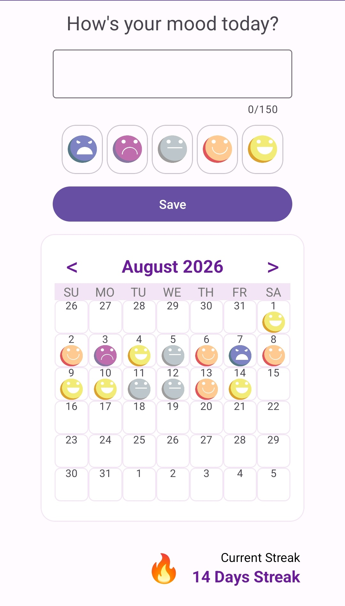
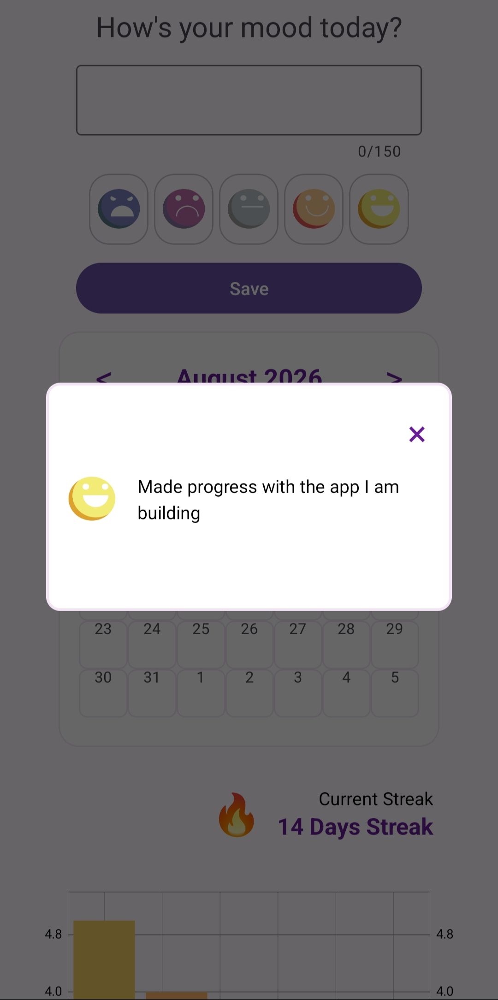
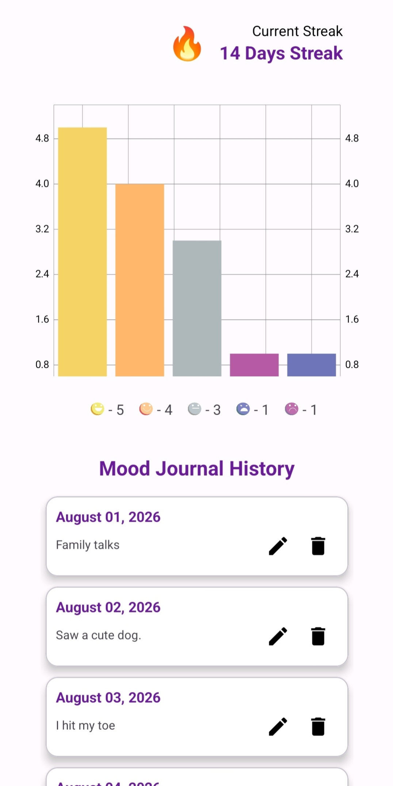

# MoodTracker
Mood Tracker App is an android app that let's you journal your mood for the day. It gave insight on your mood count for the month with a Bar Chart. It's built using Kotlin and Room Database with CRUD operations.

## Screenshots

### Splash Screen

### Input Mood and Calendar

### View your mood in Calendar

### Mood Bar Chart

### Edit Mood Entry

### Whole Scrolled Screen View

